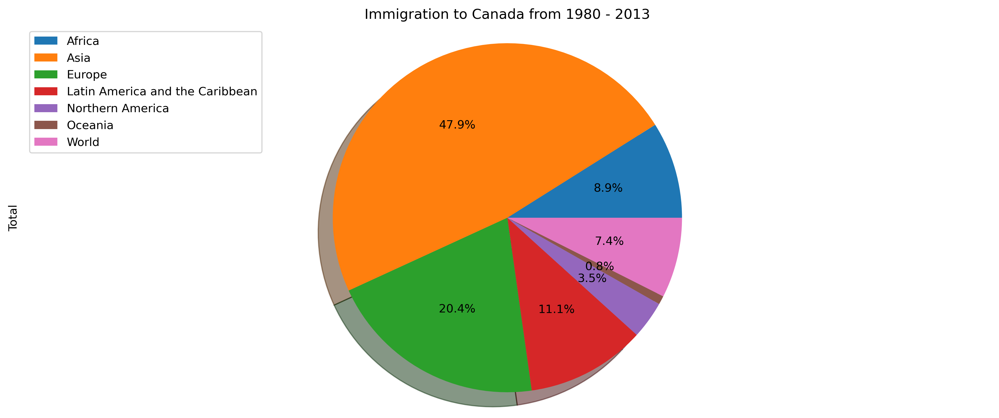
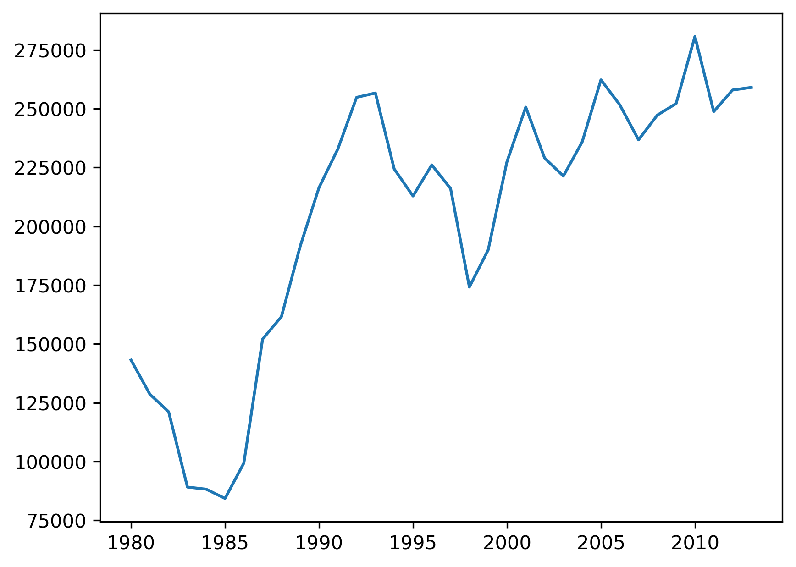

# 🌍 Immigration to Canada Data Analysis (1980–2013)

## 📌 Overview

This project analyzes immigration trends to Canada from 1980 to 2013 using Python.

## 🎯 Objectives

* Analyze trends over time
* Compare immigration patterns between continents

## 🛠 Tools & Libraries

* Python
* pandas
* matplotlib

## 📊 Sample Visualizations

### Continents by Immigration

### Immigration Trends Over Time

## 📂 Dataset

Immigration dataset (1980–2013)

## 💡 Key Insights

* A small number of countries contribute the majority of immigrants
* Immigration trends increased significantly after the 1990s
* Asian countries dominate immigration numbers

## 🚀 How to Run

1. Install required libraries:
   pip install pandas matplotlib seaborn

2. Open the notebook:
   jupyter notebook analysis.ipynb

3. Run all cells

## 👨‍💻 Author

Omar Alnihwi
